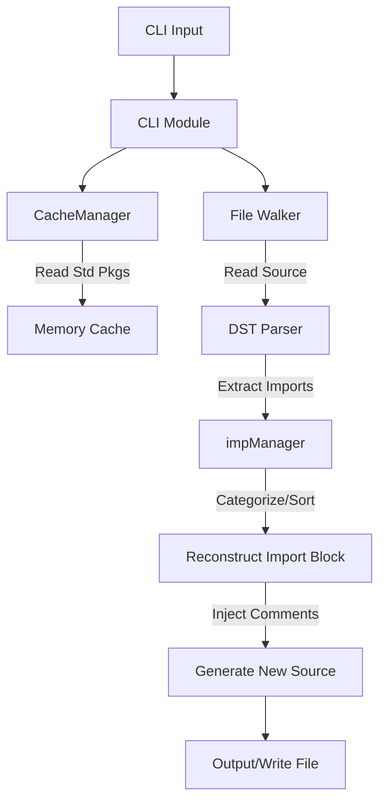

# alignpkg - Go Import Grouping and Sorting Tool

English | [简体中文](./README.md)

`alignpkg` is a command-line tool designed to automatically reorder, group, and format Go import statements. It aims to resolve Git merge conflicts caused by inconsistent import orders and improve code readability.

## Key Features

- **Smart Grouping**: Automatically categorizes imports into four groups:
  1. **Standard**: Built-in Go standard library packages.
  2. **Third-party**: External dependency packages.
  3. **Secondary**: Packages with a specific prefix (e.g., internal shared libraries) defined via the `-second` flag.
  4. **Local**: Packages belonging to the current module, with auto-detection support.
- **Comment Preservation**: Built on `dave/dst` (Decorated Syntax Tree), it ensures that all line-start and trailing comments associated with imports are preserved during reordering.
- **Environment Awareness**:
  - Automatically traverses the directory tree to find `go.mod` and identify the module name.
  - Automatically detects and maintains the original line ending format (LF or CRLF).
- **Performance Optimized**:
  - Includes a `CacheManager` for standard library paths to avoid redundant `packages.Load` calls.
  - Efficient file traversal and processing.
- **Flexible Configuration**: Allows specifying local prefixes, secondary prefixes, and output targets via command-line flags.

## Installation

```shell
go install github.com/yougg/alignpkg@latest
```

## Usage

### Basic Syntax

```shell
alignpkg [flags] [path ...]
```

### Common Flags

- `-w`, `-write`: Write the result directly to the source file.
- `-l`, `-list`: Output the results to stdout.
- `-local "prefix"`: Specify the local package prefix. If omitted, the tool attempts to auto-detect it from `go.mod`.
- `-second "prefix"`: Specify a secondary prefix (e.g., for internal private libraries).
- `-single`: Transform single import to block format
- `-v`: Enable verbose logging.
- `-u`: Update the standard library cache (recommended after changing Go versions).

### Example

```shell
# Process all Go files in the current directory and its subdirectories, modifying them in place.
alignpkg -w ./...
```

```go
package main

import (
	"fmt"
	"log"
	APZ "bitbucket.org/example/package/name"
	APA "bitbucket.org/example/package/name"
	"github.com/yougg/alignpkg/package2"
	"github.com/yougg/alignpkg/package1"
)
import (
	"net/http/httptest"
)

import "bitbucket.org/example/package/name2"
import "bitbucket.org/example/package/name3"
import "bitbucket.org/example/package/name4"
```

it will be transformed into:

```go
package main

import (
    "fmt"
    "log"
    "net/http/httptest"

    APA "bitbucket.org/example/package/name"
    APZ "bitbucket.org/example/package/name"
    "bitbucket.org/example/package/name2"
    "bitbucket.org/example/package/name3"
    "bitbucket.org/example/package/name4"

    "github.com/yougg/alignpkg/package1"
    "github.com/yougg/alignpkg/package2"
)
```

## Architecture

The project is designed with modularity to ensure accurate parsing and efficient processing.

### Architecture Diagram



### Import Reordering Workflow

1. **Parse**: Use `dst` to parse Go source code into a decorated syntax tree, extracting `IMPORT` nodes from `GenDecl`.
2. **Categorize**:
   - Check if the package is in the `standardPackages` cache.
   - Check if it matches the `localPrefix`.
   - Check if it matches the `secondPrefix`.
   - Otherwise, categorize as third-party.
3. **Sort**: Within each category, sort imports alphabetically by their path.
4. **Format**: Reconstruct the import block according to the line ending (LF/CRLF), inserting blank lines between different categories.
5. **Replace**: Delete the old import nodes and inject the new block below the `package` declaration while maintaining the file's original style.

## Contributing

Issues and Pull Requests are welcome to improve the tool.

## License

This project is licensed under the [MIT](./LICENSE) License.
