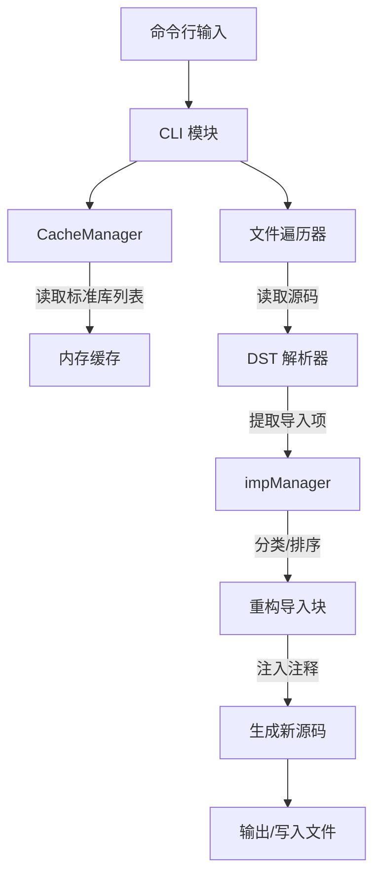

# alignpkg - Go 导入包自动分组与排序工具

[English](./README.en.md) | 简体中文

`alignpkg` 是一个用于自动重排、分组和格式化 Go 语言导入包（Imports）的命令行工具。它旨在解决团队开发中因导入包顺序不一致导致的 Git 冲突，并提升代码的可读性。

## 功能特性

- **自动分组**：将导入包自动划分为四类：
  1. **标准库 (Standard)**：Go 内建标准库。
  2. **第三方库 (Third-party)**：外部依赖包。
  3. **第二方库 (Secondary)**：通过 `-second` 指定的特定前缀包（如公司内部公共库）。
  4. **第一方库 (Local)**：当前项目所属模块的包，支持自动检测。
- **保留注释**：基于 `dave/dst`（Decorated Syntax Tree）解析，确保在重排过程中，导入包关联的行首注释和行尾注释不会丢失。
- **检测环境**：
  - 向上遍历目录树查找 `go.mod` 以识别模块名。
  - 识别并保持源文件的行尾格式（LF 或 CRLF）。
- **性能优化**：
  - 内建标准库信息缓存机制 `CacheManager`，避免重复执行 `packages.Load`。
  - 支持并发处理（通过文件遍历逻辑）。
- **灵活配置**：通过命令行指定本地前缀、输出方式等。

## 安装

```shell
go install github.com/yougg/alignpkg@latest
```

## 使用说明

### 基本语法

```shell
alignpkg [flags] [path ...]
```

### 常用参数

- `-w`, `-write`: 直接修改（写入）源文件。
- `-l`, `-list`: 将结果输出到控制台。
- `-local "prefix"`: 指定本地包前缀。若未指定，工具将尝试从 `go.mod` 自动识别。
- `-second "prefix"`: 指定二级前缀（如内部私有库前缀）。
- `-single "mode"`: 设置单条导入包的格式。可选值：`keep` (默认，保持原样), `oneline` (强制单行), `group` (强制括号分组)。
- `-v`: 启用详细日志输出。
- `-u`: 更新标准库缓存（切换 Go 版本后建议使用）。

### 示例

```shell
# 处理当前目录及子目录下所有 Go 文件，并直接保存修改
alignpkg -w ./...
```

```go
package main

import (
	"fmt"
	"log"
	APZ "bitbucket.org/example/package/name"
	APA "bitbucket.org/example/package/name"
	"github.com/yougg/alignpkg/package2"
	"github.com/yougg/alignpkg/package1"
)
import (
	"net/http/httptest"
)

import "bitbucket.org/example/package/name2"
import "bitbucket.org/example/package/name3"
import "bitbucket.org/example/package/name4"
```

上面内容将被转换为:

```go
package main

import (
    "fmt"
    "log"
    "net/http/httptest"

    APA "bitbucket.org/example/package/name"
    APZ "bitbucket.org/example/package/name"
    "bitbucket.org/example/package/name2"
    "bitbucket.org/example/package/name3"
    "bitbucket.org/example/package/name4"

    "github.com/yougg/alignpkg/package1"
    "github.com/yougg/alignpkg/package2"
)
```

## 架构逻辑

本项目采用模块化设计，确保解析的准确性和处理的高效性。

### 架构图



### 导入包重排流程

1. **解析 (Parse)**：使用 `dst` 将 Go 源码解析为装饰语法树，提取 `GenDecl` 中的 `IMPORT` 节点。
2. **分类 (Categorize)**：
   - 检查是否在 `standardPackages` 缓存中。
   - 检查是否匹配 `localPrefix`。
   - 检查是否匹配 `secondPrefix`。
   - 否则归类为第三方库。
3. **排序 (Sort)**：在每个分类内部，按导入路径的字母顺序进行升序排列。
4. **格式化 (Format)**：根据行尾符（LF/CRLF）重新拼接导入块，在不同分类之间插入空行。
5. **替换 (Replace)**：删除旧的导入节点，在 `package` 声明下方注入新的导入块，并保持文件原有风格。

## 贡献

欢迎提交 Issue 或 Pull Request 来改进工具。

## 许可证

本项目采用 [MIT](./LICENSE) 许可证。
